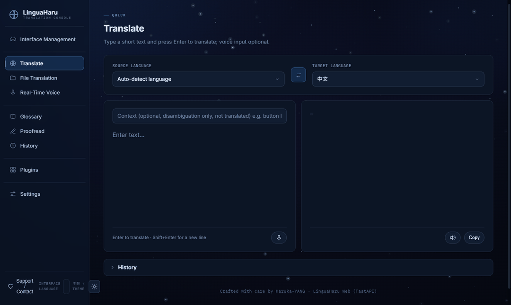

<div align="center">
  

English | [简体中文](README_ZH.md) | [日本語](README_JP.md) 
<br/><a href="https://github.com/YANG-Haruka/LinguaHaru/wiki/en-Home" target="_blank">📚 User Guide (Wiki)</a>


<div align=center>      </div>
<p align='center'>Next-generation AI translation tool that provides high-quality, precise translations for various common file formats with a single click</p>
<h3 align='center'>Supported File Formats</h3>
<p align='center'><b>📄 DOCX</b> • <b>📊 XLSX</b> • <b>📑 PPTX</b> • <b>📰 PDF</b> • <b>📝 TXT</b> • <b>🎬 SRT/ASS/VTT/LRC</b> • <b>📘 MD</b> • <b>📚 EPUB</b> • <b>🗂 CSV/TSV</b> • <b>🌐 HTML</b> • <b>📃 ODT</b> • <b>🔤 JSON</b></p>

</div>
<h2 id="What's This">What's This?</h2>
This translation tool is based on cutting-edge large language models, offering exceptional translation quality with minimal operation, supporting multiple document formats and languages.

It provides the following features:

- Multi-format compatibility: Perfect support for common file formats including .docx, .pptx, .xlsx, .pdf, .txt, .srt, with more document types to be expanded in the future.
- Global language translation: Covers 10+ languages including Chinese/English/Japanese/Korean/Russian, continuously expanding to meet globalization needs.
- One-click rapid translation: No complicated operations needed, just upload a file and click translate to instantly generate accurate translations.
- Flexible translation engines: Freely switch between local models (Ollama) and online APIs (Deepseek/OpenAI, etc.), adapting to different usage environments at any time.
- LAN sharing: One host computer can easily be used by all devices on the local network, enabling efficient collaborative work.


<h2 id="install">Installation and Usage</h2>

1. [CUDA](https://developer.nvidia.com/cuda-downloads)   
You need to install CUDA (currently 11.7 and 12.1 have been tested without issues)  

2. Python (python==3.12)  
    It is recommended to use [Conda](https://www.anaconda.com/download) to create a virtual environment  
    ```bash
    conda create -n lingua-haru python=3.12
    conda activate lingua-haru
    ```

3. Install dependencies
    - Dependency packages
        ```bash
        pip install -r requirements/base.txt
        ```
    - Optional modules (install only what you need; the UI enables them automatically)
        ```bash
        # Image translation (.png/.jpg/...): OCR + render translation back onto the image
        pip install -r requirements/ocr.txt

        # Video/audio subtitle translation (.mp4/.mp3/...): transcribe with Whisper, then translate
        # ffmpeg is bundled (imageio-ffmpeg) — no PATH install needed; a PATH ffmpeg is used if present
        pip install -r requirements/video.txt
        ```


4. Run the tool

    **Web app (FastAPI)** — browser UI:
    ```bash
    pip install -r requirements/web.txt
    python -m webapp.server
    ```
    Default access address is
    ```bash
    http://127.0.0.1:8080
    ```

    **Desktop app (Qt)** — recommended native desktop experience (Fluent Design):
    ```bash
    pip install -r requirements/qt.txt
    python app_qt.py
    ```

5. Local large language model support  
    Currently only supports [Ollama](https://ollama.com/)  
    You need to download Ollama dependencies and models for translation
    - Download model (QWen series models recommended)
        ```bash
        ollama pull qwen2.5
        ```

<h2 id="preview">Preview</h2>
<div align="center">
  
</div>


## Project Structure
Clear split: **`core/` = backend** (all non-UI logic), **`webapp/` + `qt_app/` = frontends**, **`config/` = static config**, **`assets/` = static assets**, **`data/` = mutable runtime state**.
```
core/                Backend — all non-UI logic
  engine/            Translation engine (base translator, response checker, splitter)
  translators/       Per-format translator classes (docx, pptx, xlsx, pdf, srt, ...)
  pipelines/         Per-format extract/restore + media (STT) / image (OCR)
  llm/               LLM API wrappers (online / offline)
  backend.py + services: languages, history, pricing, updater, api_keys,
                     optional_modules, module_manager, prompts, logging
webapp/              Web frontend — FastAPI (server.py) + static/ (HTML/CSS/JS)
qt_app/              Desktop frontend — PySide6 + Fluent Widgets
config/              Static config — system_config.json, api_config/, prompts/, locales/
assets/              Static assets — img/ (icons, gif), models/ (tiktoken BPE)
data/                Mutable runtime — temp/, result/, log/, web_uploads/ (gitignored);
                     glossary/ (tracked); mykeys/ (gitignored, local API keys)
requirements/        base.txt + per-feature extras (web, qt, ocr, pdf, video)
tests/               Test suite (corpus per format, qt, web sessions, i18n, ...)
```

## Reference Projects
- [ollama-python](https://github.com/ollama/ollama-python)
- [PDFMathTranslate](https://github.com/Byaidu/PDFMathTranslate)

## To-Do List
- Add continue translation functionality.

## Changelog
- 2026/01/28
V5.0 update: Updated PDF library. Optimized UI interface. Added more practical features. Thanks for a year of companionship!
- 2025/05/09
V3.0 update: Added multithreading and continuation translation features. Added translation support for Markdown files. Enhanced support for the Qwen3 series. Optimized log display.
- 2025/04/02  
Updated to v2.3, adding custom icons/Title and supporting multi-task queues. Optimized translation result detection logic. Added a feature to show the translation result with the original text.
- 2025/03/14
Updated to V2.0, added support for Txt files. Optimized Word/Excel/long text translation. Added customizable retry count functionality. Improved display of translation results.
- 2025/02/01  
Updated the processing logic for failed translations.
- 2025/01/15  
Fixed a bug in PDF translation, added multilingual support, and petted the kitty.
- 2025/01/11  
Added support for PDF. Reference project: [PDFMathTranslate](https://github.com/Byaidu/PDFMathTranslate)
- 2025/01/10    
Added support for deepseek-v3. Now you can use API for translation (more stable).  
Get API: https://www.deepseek.com/
- 2025/01/03  
Happy New Year! Revised logic, added review functionality, and enhanced logging.


## Software Disclaimer  
This software is fully open-source under the GPL-3.0 license and can be freely used.
It only provides AI-based translation services; the creator holds no responsibility for the translated content.
Please ensure your use complies with applicable laws and regulations.
Attribution is always appreciated and makes us happy~ but it's totally optional (´ω｀)♡
