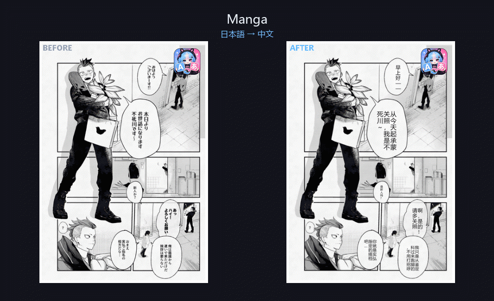
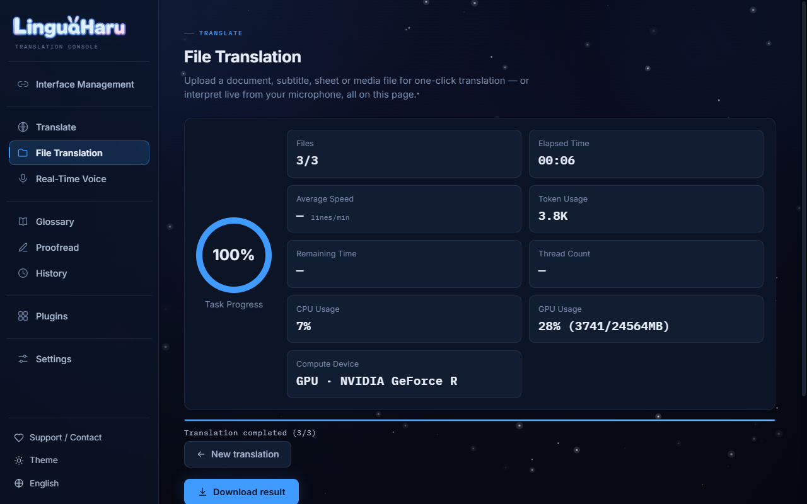
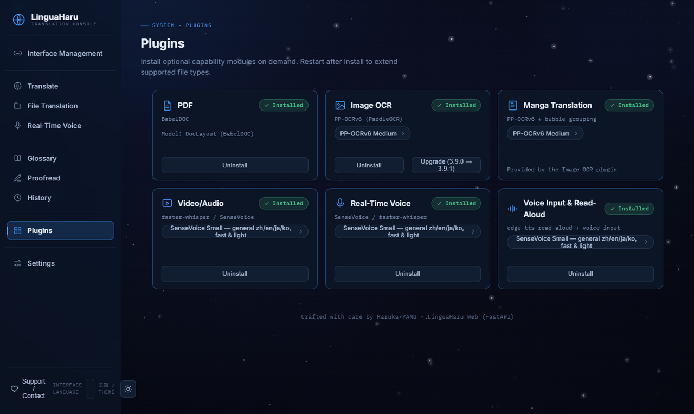
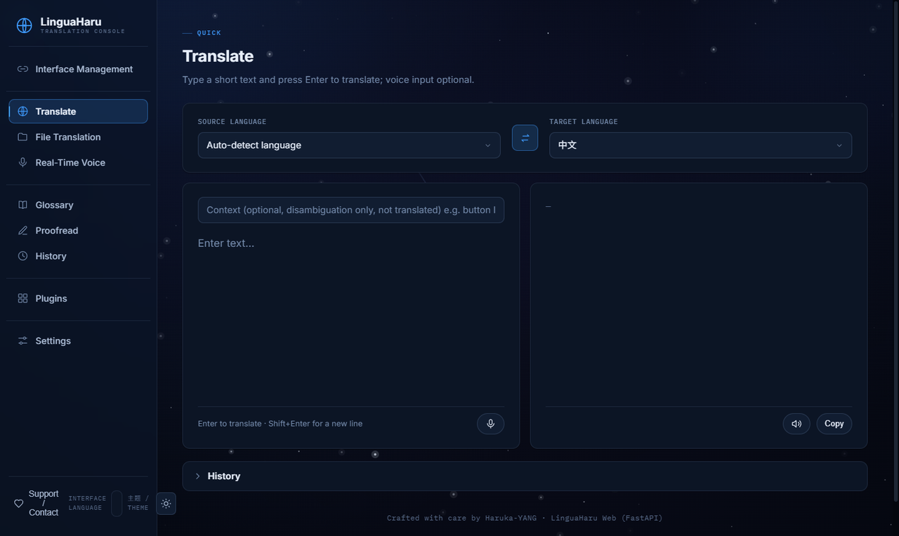
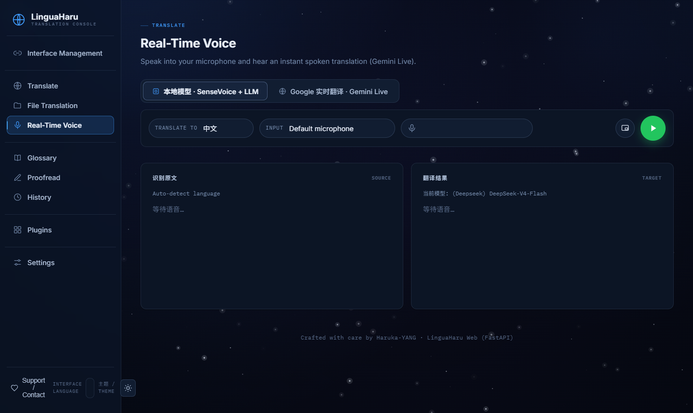
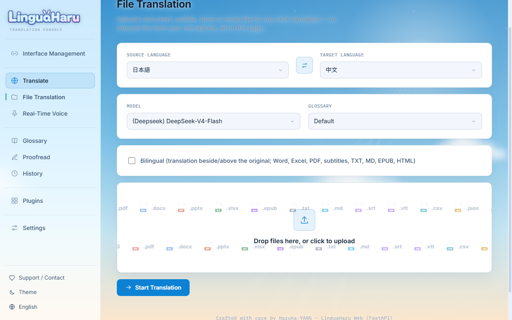
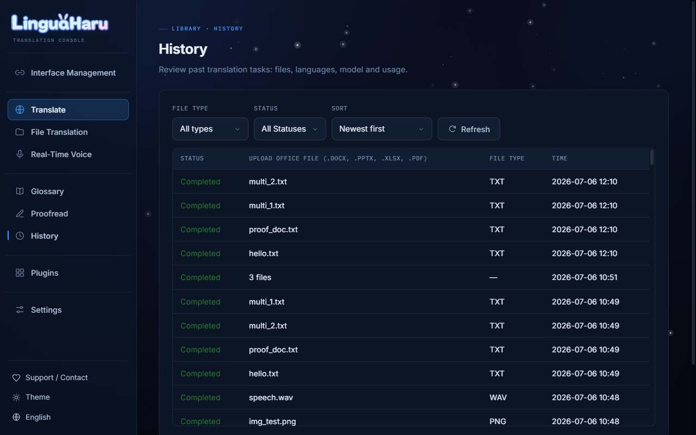

<div align="center">
  

  <h1>LinguaHaru</h1>

  <p>
    <a href="README.md">English</a> | <a href="README_ZH.md">简体中文</a> | 日本語
    <br/>
    <a href="https://github.com/YANG-Haruka/LinguaHaru/wiki" target="_blank">ユーザーガイド（Wiki）</a>
  </p>

  <p>
    
    
    
    
    
  </p>

  <p><b>ドキュメント・字幕・画像・動画・ライブ音声を、ワンクリックで高品質 AI 翻訳。</b><br/>
  作り込まれた 2 つのフロントエンド（ネイティブデスクトップ + Web コンソール）が、実績あるひとつのエンジンを共有。解凍するだけ、インストール不要。</p>
</div>

<div align="center">
  
  <br/><sub><b>左が原文、右が翻訳</b> —— 漫画・PDF 論文・Word・Excel、レイアウト・画像・書式をそのまま保持。</sub>
  <br/><br/>
  
  <br/><sub>Web コンソールの操作フロー。</sub>
</div>

---

## 対応フォーマット

| カテゴリ | フォーマット |
|---|---|
| オフィス文書 | DOCX · PPTX · XLSX · PDF |
| テキスト・電子書籍 | TXT · Markdown · EPUB · HTML · ODT · JSON · CSV / TSV |
| 字幕 | SRT · VTT · ASS · SSA · LRC |
| 画像（プラグイン） | PNG · JPG · WebP · BMP …… スキャン漫画にも対応 |
| 動画・音声（プラグイン） | MP4 · MKV · MP3 · WAV …… 自動文字起こし + 字幕翻訳 |
| ライブ音声（プラグイン） | マイクまたはシステム音声を、話しながらリアルタイム翻訳 |

## LinguaHaru を選ぶ理由

**品質と速度のために作られた翻訳エンジン。** スマートなバッチ処理、モデル別レート制御付き並列リクエスト、翻訳キャッシュ、用語集の強制適用、プレースホルダー保護、翻訳後の QA チェック。アトミックな逐次書き込みでどのジョブもクラッシュ安全。中断したタスクは正確に再開でき、6.0 エンジンは前世代より 90% 以上高速です。

**2 つの完全なフロントエンド、1 つのバックエンド。**
- **デスクトップ** —— Fluent Design のネイティブ Windows アプリ（ライト/ダーク、フローティング字幕、ドラッグ&ドロップ対応）。
- **Web コンソール** —— ブラウザで同じ全機能。マルチユーザーセッション分離、LAN 共有、公開サーバーモード。

**重い機能はすべてプラグイン。** 基本パッケージは小さいまま、必要なものだけをアプリ内のプラグインページからインストール。NVIDIA GPU は自動検出され、GPU ランタイム（CUDA torch、onnxruntime-gpu）も自動導入。アンインストール時は依存関係を完全に回収します。

| プラグイン | 追加される機能 | GPU |
|---|---|---|
| PDF | レイアウトを保持した PDF 翻訳（BabelDOC エンジン） | — |
| 画像 OCR | 文字を描き戻す画像翻訳；PP-OCRv6 | 自動（約 60× 高速化） |
| 漫画モード | スキャン漫画/PDF の吹き出し検出・文字消去・訳文描き戻し、校正後の再出力に対応 | 自動 |
| 動画/音声 | 音声認識（SenseVoice、Whisper、Qwen3-ASR）+ 字幕翻訳；ffmpeg 同梱 | 自動 |
| リアルタイム音声 | ストリーミング字幕、文単位の補正、幻覚ガード、用語集の適用 | 自動 |
| 音声入力 | クイック翻訳ページのマイク入力と読み上げ | 自動 |

**毎日使いたくなる便利さ。** Google 風クイック翻訳（音声入力・読み上げ付き）、用語集の完全管理（新規/インポート/削除、文書・クイック・ライブ翻訳すべてに適用）、プロジェクト別履歴とワンクリック再開、トークン数とコストのリアルタイム見積もり、アプリ内校正エディタと再出力、初回起動時のインタラクティブツアー、13 言語の完全ローカライズ UI。

**安全で安定。** 致命的な API エラー（無効なキー、残高不足）を検出してあなたの言語で説明。失敗・中断したタスクは履歴に残り再開可能。Web はユーザー別セッション分離 + CSRF 保護。SHA-256 検証付きセルフアップデートは失敗時に自動ロールバック。

**中国大陸のネットワークにも優しい。** 依存関係・モデル・アップデートのすべてが高速ミラーへ自動フォールバック（Tsinghua PyPI、hf-mirror、ModelScope、Baidu BOS、ghproxy）。

## クイックスタート

### 方法 A（推奨）：ポータブル版

Python も CUDA 設定も不要。ダウンロードして解凍、ダブルクリックするだけ。

1. [Releases](https://github.com/YANG-Haruka/LinguaHaru/releases/latest) からダウンロード：
   - `LinguaHaru-*-desktop-portable.zip` —— ネイティブデスクトップ版
   - `LinguaHaru-*-web-portable.zip` —— Web 版（ブラウザが自動で開きます）
2. 任意の場所に解凍し、`Start-Desktop.bat` または `Start-Web.bat` を実行。
3. **インターフェース管理** でインターフェースを追加（例：DeepSeek）、API キーを貼り付けてカードをクリックして有効化。
4. PDF / OCR / 動画 / ライブ音声が必要なら、**プラグイン** ページからワンクリックでインストール —— GPU は自動処理。
5. 新バージョンが出たらアプリ内でそのままアップデート —— プラグイン・モデル・設定はすべて保持されます。

### 方法 B：ソースから実行

```bash
conda create -n lingua-haru python=3.12 && conda activate lingua-haru
pip install -r requirements/base.txt

pip install -r requirements/web.txt   # Web:        python -m webapp.server
pip install -r requirements/qt.txt    # デスクトップ: python app_qt.py
```

オプションのプラグインはアプリ内から、または手動でインストールできます：

```bash
pip install -r plugins/pdf/requirements.txt       # PDF（BabelDOC）
pip install -r plugins/ocr/requirements.txt       # 画像 OCR + 漫画モード
pip install -r plugins/video/requirements.txt     # 動画/音声 + リアルタイム音声
pip install -r plugins/speechio/requirements.txt  # 音声入力 + 読み上げ
```

### 推奨エンジン

**[DeepSeek](https://platform.deepseek.com/) の最新 Flash モデル** —— 速く、高品質で、安価。インターフェース管理に API キーを貼り付けて有効化するだけ。

ローカルモデル（Ollama / LM Studio）はオフラインやプライバシー重視の用途に対応していますが、多くの場合オンライン API の方が明らかに高速で高品質です。

## スクリーンショット

<table>
  <tr>
    <td></td>
    <td></td>
  </tr>
  <tr>
    <td align="center"><sub>ワンクリック翻訳 + ライブダッシュボード</sub></td>
    <td align="center"><sub>オンデマンドプラグイン + GPU 自動</sub></td>
  </tr>
  <tr>
    <td></td>
    <td></td>
  </tr>
  <tr>
    <td align="center"><sub>クイック翻訳（音声入力付き）</sub></td>
    <td align="center"><sub>リアルタイム音声字幕</sub></td>
  </tr>
  <tr>
    <td></td>
    <td></td>
  </tr>
  <tr>
    <td align="center"><sub>ライトテーマ</sub></td>
    <td align="center"><sub>履歴 + ワンクリック再開</sub></td>
  </tr>
</table>

## デプロイ

| モード | 方法 |
|---|---|
| デスクトップ | `Start-Desktop.bat`（ポータブル）または `python app_qt.py` |
| ローカル Web | `Start-Web.bat`（ポータブル）または `python -m webapp.server` —— 8080 から空きポートを自動選択 |
| LAN 共有 | Web 設定で LAN モードをオン。同一ネットワークの全デバイスで 1 台のホストを共有 |
| 公開サーバー | サーバーモードは訪問者からキー/モデル管理を隠し、ホストのキーで提供 |
| Docker | `docker compose up -d` —— `Dockerfile` / `docker-compose.yml` 参照；`HOST` / `PORT` / `ADMIN_PASSWORD` に対応 |

## プロジェクト構成

```
core/                バックエンド —— UI 以外の全ロジック
  engine/            翻訳エンジン（バッチ、リトライ、QA、キャッシュ）
  translators/       フォーマット別トランスレータ（docx、pptx、xlsx、pdf、srt……）
  pipelines/         抽出/復元パイプライン + メディア（STT）/ 画像（OCR）/ 漫画
  llm/               LLM API ラッパー（オンライン / ローカル）
webapp/              Web フロントエンド —— FastAPI + 静的 HTML/CSS/JS
qt_app/              デスクトップフロントエンド —— PySide6 + Fluent Widgets
plugins/             オプションプラグインのマニフェスト（アプリ内でオンデマンド導入）
config/              静的設定 —— プロンプト、言語パック、API 設定、デフォルト設定
assets/              静的アセット —— アイコン、画像、tiktoken データ
glossary/            シード用語集（Default.csv）
requirements/        base.txt + フロントエンド別追加依存
tools/               ビルドスクリプト（ポータブルビルダー）
tests/               テストスイート（フォーマットコーパス、Web セッション、i18n、アップデーター……）
```

## お問い合わせ

<div align="center">
  <a href="https://www.harukayang.com/" target="_blank">ホームページ</a> ·
  <a href="https://www.linkedin.com/in/yang-haruka/" target="_blank">LinkedIn</a> ·
  QQ 3234306205 · WeChat HarukaQnQ
</div>

## 免責事項

本ソフトウェアは GPL-3.0 ライセンスの下で完全にオープンソースであり、自由に使用できます。
AI による翻訳サービスのみを提供するものであり、翻訳内容について作者は一切の責任を負いません。
関連する法令を遵守してご利用ください。
クレジット表記はいつでも嬉しいですが、完全に任意です (´ω｀)♡
